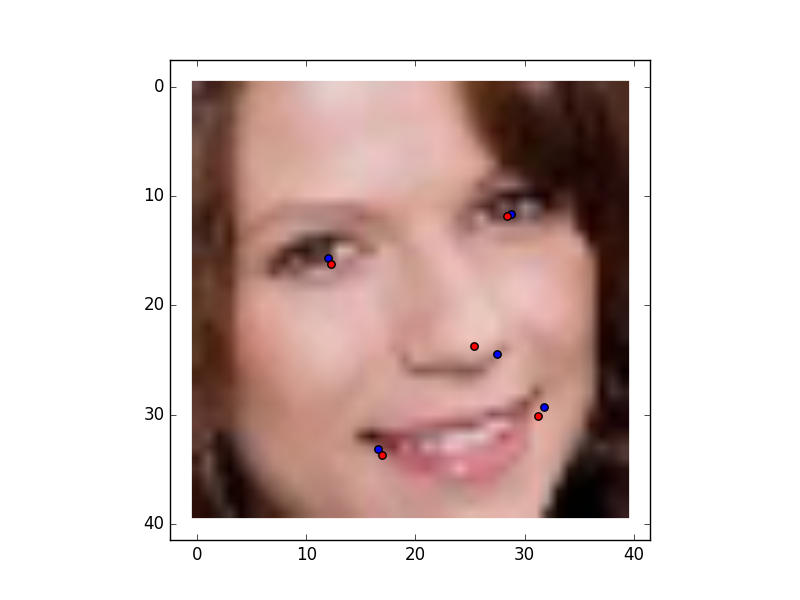
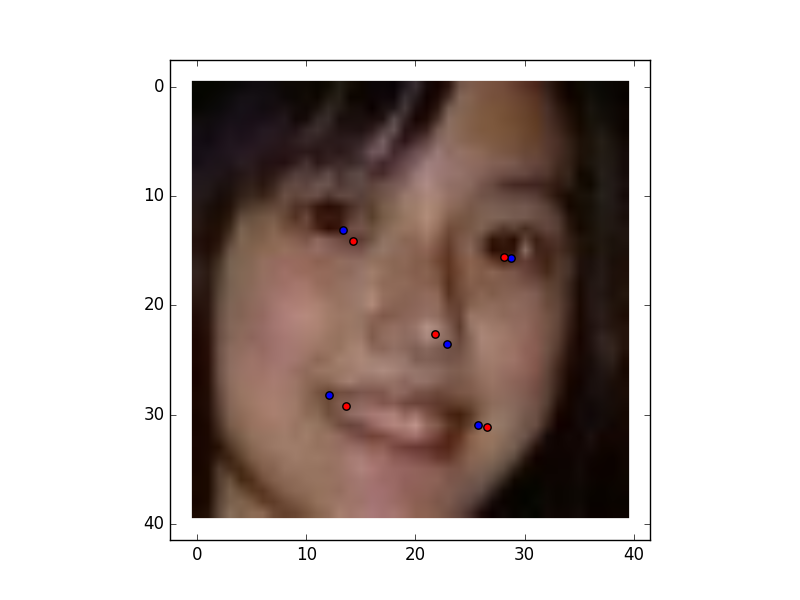
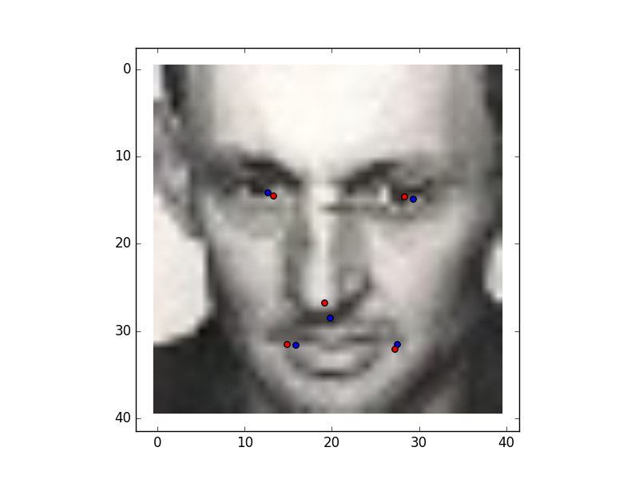
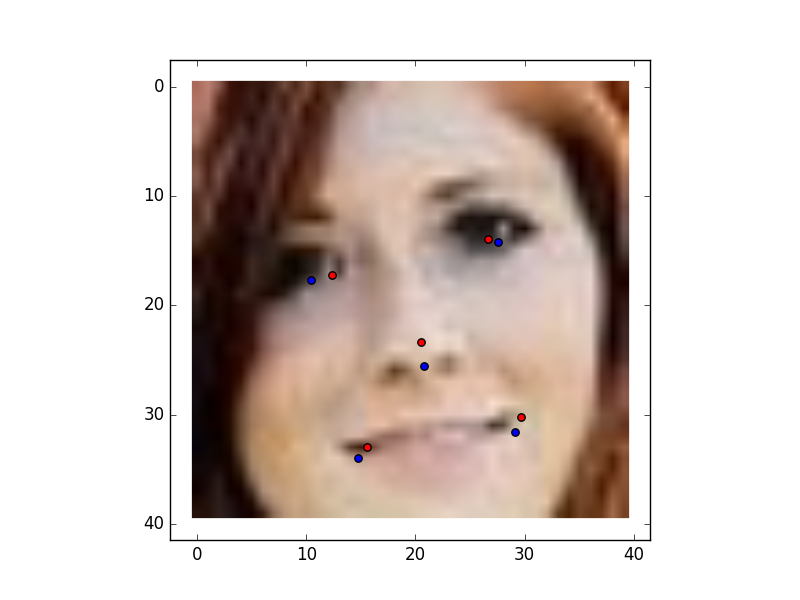

### Set the parameter
set the parameters in dataset.py

```
DATASET_PATH = 'dataset/MTFL/'
HAAR_FOLDER = '/home/username/opencv/opencv-master/data/haarcascades/'
HAAR_FILE = 'haarcascade_frontalface_default.xml'
```

### Training
The code has been tested on [MTFL][mtfl_link] dataset
Please remove the space characters on the begining of every line in the annotation file.
Alternatively, files from the annotations folder can be copied to the dataset folder. 

### Some Test
blue points are the ground-truth red points are the detection





[mtfl_link]: http://mmlab.ie.cuhk.edu.hk/projects/TCDCN/data/MTFL.zip
